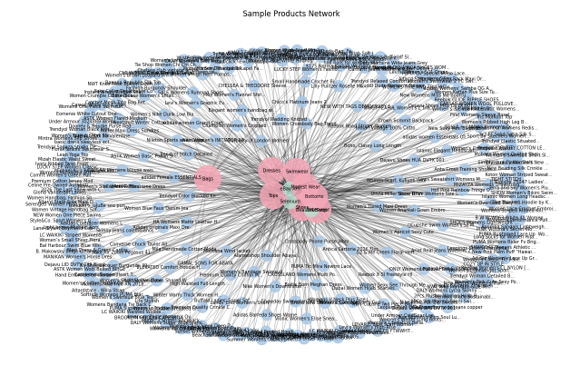
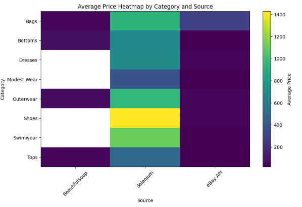

# Women Fashion E-Commerce Data Analysis

## Overview
This project focuses on collecting and analyzing women fashion product data from multiple e-commerce sources.  
The workflow includes data acquisition, preprocessing, and building visual insights to understand product distribution and pricing patterns.

---

## Data Sources
- Web scraping using BeautifulSoup  
- eBay API  
- Amazon (via Selenium)

---

## Process
1. Collect data from different sources  
2. Clean and preprocess the dataset  
3. Combine all records into one dataset  
4. Build a NetworkX graph to represent relationships  
5. Generate visualizations for analysis  

---

## Analysis
- Product distribution across categories  
- Price comparison between sources  
- Network relationships between products, categories, and sources  
- Heatmap for average price patterns  

---

## Visualizations

### Network Graph

### Price Heatmap

---

## Tools Used
- Python  
- Pandas  
- BeautifulSoup  
- Selenium  
- NetworkX  
- Matplotlib / Plotly  

---

## Files
- `women_fashion_analysis.ipynb` → main notebook  
- `fashion_products.csv` → dataset  
- `project_report.pdf` → full report  

---

## Notes
This project was developed as part of a data acquisition and analysis coursework, focusing on applying real-world data collection and visualization techniques.

---

## Author
Malak Osama
